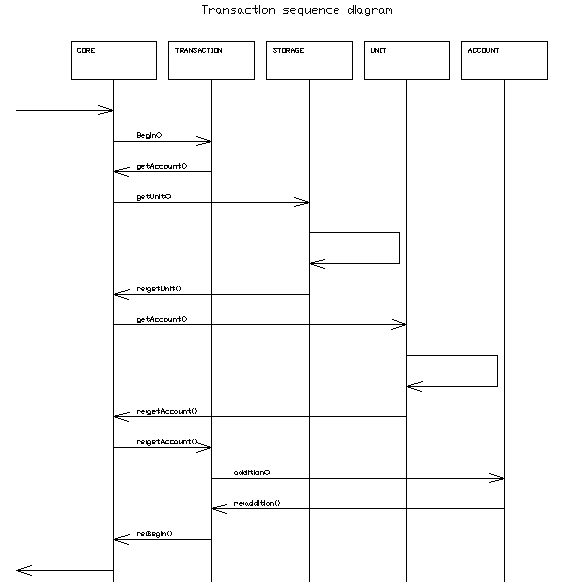

# transaction

[](https://travis-ci.org/claygod/transaction)
[](https://godoc.org/github.com/claygod/transaction)
[](https://goreportcard.com/report/github.com/claygod/transaction)

Embedded transactional database of accounts, running in multithreaded mode. Coverage 91.3%

The library operates only with integers. If you want to work with hundredths (for example, cents in dollars), multiply everything by 100. For example, a dollar and a half, it will be 150.
Limit on the maximum account size: 2 to 63 degrees (9,223,372,036,854,775,807). For example: on the account can not be more than $92,233,720,368,547,758.07

The library works in parallel mode and can process millions of requests per second.
Parallel requests to the same account should not lead to an erroneous change in the balance of this account.
Debit and credit with the account can be done ONLY as part of the transaction.

The library has two main entities: a unit and an account.

### Unit

- A unit can be a customer, a company, etc.
- A unit can have many accounts (accounts are called a string variable)
- A unit can not be deleted if at least one of its accounts is not zero
- If a unit receives a certain amount for a nonexistent account, such an account will be created

### Account

- The account serves to account for money, shares, etc.
- The account necessarily belongs to any unit.
- The account belongs to only one unit.
- There is only one balance on one account.
- Balance is calculated only in whole numbers.

## Usage

Important: in the description of methods all error return codes are written.
Descriptions in the documentation: https://godoc.org/github.com/claygod/transaction
The transaction has no limits on the number of credits and debits.

### Create / delete

```go
tr := transaction.New()
tr.Start()
tr.AddUnit(123)
tr.DelUnit(123)
```	

### Credit/debit of an account

Credit and debit operations with the account:

```go
t.Begin().Credit(id, "USD", 1).End()
```	

```go
t.Begin().Debit(id, "USD", 1).End()
```

### Transfer

Example of transfer of one dollar from one account to another.

```go
t.Begin().
	Credit(idFrom, "USD", 1).
	Debit(idTo, "USD", 1).
	End()
```

### Purchase / Sale

A purchase is essentially two simultaneous funds transfers

```go
// Example of buying two shares of "Apple" for $10
tr.Begin().
	Credit(buyerId, "USD", 10).Debit(sellerId, "USD", 10).
	Debit(sellerId, "APPLE", 2).Credit(buyerId, "APPLE", 2).
	End()
```

### Save / Load

```go
// Example of buying two shares of "Apple" for $10
tr.Begin().
	Credit(buyerId, "USD", 10).Debit(sellerId, "USD", 10).
	Debit(sellerId, "APPLE", 2).Credit(buyerId, "APPLE", 2).
	End()
```

### Example

```go
package main

import (
	"fmt"

	tn "github.com/claygod/transaction"
)

func main() {
	tr := tn.New()
	tr.Start()

	// add unit
	switch res := tr.AddUnit(123); res {
	case tn.Ok:
		fmt.Println("Done! Unit created")
	case tn.ErrCodeCoreCatch:
		fmt.Println("Not obtained permission")
	case tn.ErrCodeUnitExist:
		fmt.Println("Such a unit already exists")
	default:
		fmt.Println("Unknown error")
	}

	// transaction
	switch res := tr.Begin().Debit(123, "USD", 5).End(); res {
	case tn.Ok:
		fmt.Println("Done! Money added")
	case tn.ErrCodeUnitNotExist:
		fmt.Println("Unit  not exist")
	case tn.ErrCodeTransactionCatch:
		fmt.Println("Account not catch")
	case tn.ErrCodeTransactionCredit:
		fmt.Println("Such a unit already exists")
	default:
		fmt.Println("Unknown error")
	}

	// save
	switch res := tr.Save("./test.tdb"); res {
	case tn.Ok:
		fmt.Println("Done! Data saved to file")
	case tn.ErrCodeCoreStop:
		fmt.Println("Unable to stop app")
	case tn.ErrCodeSaveCreateFile:
		fmt.Println("Could not create file")
	default:
		fmt.Println("Unknown error")
	}

	// del unit (There will be an error!)
	switch _, res := tr.DelUnit(123); res {
	case tn.Ok:
		fmt.Println("Done!")
	case tn.ErrCodeCoreCatch:
		fmt.Println("Not obtained permission")
	case tn.ErrCodeUnitExist:
		fmt.Println("There is no such unit")
	case tn.ErrCodeAccountNotStop:
		fmt.Println("Accounts failed to stop")
	case tn.ErrCodeUnitNotEmpty:
		fmt.Println("Accounts are not zero! You must withdraw money from the account")
	default:
		fmt.Println("Unknown error")
	}

	// transaction
	switch res := tr.Begin().Credit(123, "USD", 5).End(); res {
	case tn.Ok:
		fmt.Println("Done! Account cleared")
	case tn.ErrCodeUnitNotExist:
		fmt.Println("Unit not exist")
	case tn.ErrCodeTransactionCatch:
		fmt.Println("Account not catch")
	case tn.ErrCodeTransactionCredit:
		fmt.Println("Such a unit already exists")
	default:
		fmt.Println("Unknown error")
	}

	// del unit (Now it will work out!)
	switch _, res := tr.DelUnit(123); res {
	case tn.Ok:
		fmt.Println("Done! Now the account has been deleted")
	case tn.ErrCodeCoreCatch:
		fmt.Println("Not obtained permission")
	case tn.ErrCodeUnitNotExist:
		fmt.Println("There is no such unit")
	case tn.ErrCodeAccountNotStop:
		fmt.Println("Accounts failed to stop")
	case tn.ErrCodeUnitNotEmpty:
		fmt.Println("Accounts are not zero")
	default:
		fmt.Println(res)
	}
}
```

Output:

```
Done! Unit created
Done! Money added
Done! Data saved to file
Accounts are not zero! You must withdraw money from the account
Done! Account cleared
Done! Now the account has been deleted
```

## Sequence diagram



## API

- New
- Load ("path")
- Start ()
- AddUnit(ID)
- Begin().Debit(ID, key, amount).End()
- Begin().Credit(ID, key, amount).End()
- TotalUnit(ID)
- TotalAccount(ID, key)
- DelUnit(ID)
- Stop ()
- Save ("path")

## F.A.Q.

Why can not I add or withdraw funds from the account without a transaction, because it's faster?
- The user should not be able to make a transaction on his own. This reduces the risk. In addition, in the world of finance, single operations are rare.

Does the performance of your library depend on the number of processor cores?
- Depends on the processor (cache size, number of cores, frequency, generation), and also depends on the RAM (size and speed), the number of accounts, the type of disk (HDD / SSD) when saving and loading.

I have a single-core processor, should I use your library in this case?
- The performance of the library is very high, so it will not be a brake in your application. However, the system block is better to upgrade ;-)


## ToDo

- Example of using a library as a server

## Bench

i7-6700T:

- BenchmarkCreditSequence-8     	 5000000	       358 ns/op
- BenchmarkCreditParallel-8     	10000000	       138 ns/op
- BenchmarkDebitSequence-8      	 5000000	       352 ns/op
- BenchmarkDebitParallel-8      	10000000	       141 ns/op
- BenchmarkTransferSequence-8   	 3000000	       538 ns/op
- BenchmarkTransferParallel-8   	 5000000	       242 ns/op
- BenchmarkBuySequence-8        	 2000000	       969 ns/op
- BenchmarkBuyParallel-8        	 3000000	       394 ns/op
